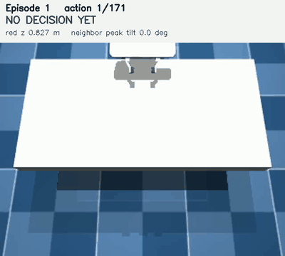
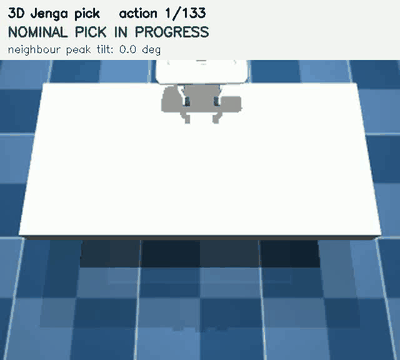
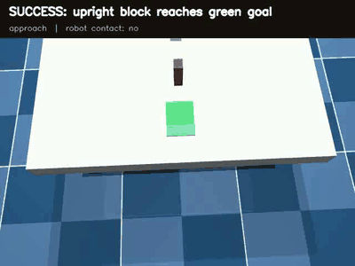
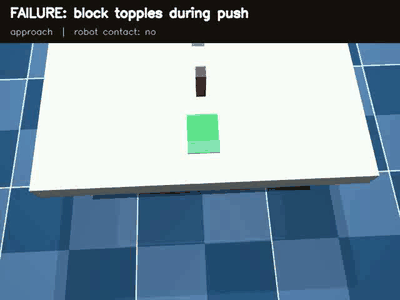
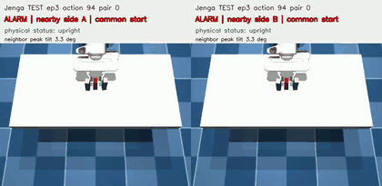
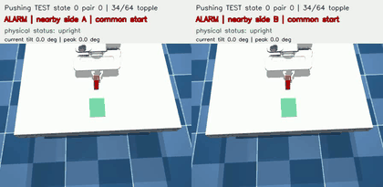

# 3D robot experiments: Jenga picking and upright pushing

**Research question:** can one task-independent monitor warn when a small, realistic execution
error would send a robot into a different physical future—without failure labels or a threshold
tuned on safe examples?

The monitor is a **boundary detector**, not a failure classifier. An alarm means “nearby versions
of this action have persistently different consequences.” A clearly safe action and an action that
fails in every nearby future can both be quiet.

---

## Task 1 — pick a Jenga block without toppling its neighbours

The Panda gripper pulls the middle block from a three-block arrangement. A task succeeds when the
target is lifted and moved while both neighbouring blocks remain upright. A neighbour reaching
45° tilt at any point is a failure.

<table>
  <tr>
    <th width="50%">Successful pick</th>
    <th width="50%">Failed pick: a neighbour topples</th>
  </tr>
  <tr>
    <td></td>
    <td></td>
  </tr>
  <tr>
    <td>Target removed; neighbours stay upright.</td>
    <td>The target is picked, but the episode is unsafe.</td>
  </tr>
</table>

Full-resolution videos: [success](results/jenga/full_episode_alarm_videos/full_episode_ep1.mp4) ·
[failure](results/presentation/3d_jenga/pick_failure.mp4)

## Task 2 — push an upright block into a goal

The same Panda controller must push one standing Jenga block into the green region. Success means
the block reaches the goal **and stays upright throughout**. The right-hand example demonstrates
why final position alone is insufficient: the block enters the goal region after toppling.

<table>
  <tr>
    <th width="50%">Successful upright push</th>
    <th width="50%">Failed push: the block topples</th>
  </tr>
  <tr>
    <td></td>
    <td></td>
  </tr>
  <tr>
    <td>1.13 cm from goal centre; peak tilt 13.5°.</td>
    <td>Peak tilt 96.2°, even though the block reaches the goal area.</td>
  </tr>
</table>

Full-resolution videos: [success](results/panda_block_push/previews/panda_block_push_success.mp4) ·
[failure](results/panda_block_push/previews/panda_block_push_failure.mp4)

---

## The monitor, step by step

The **same frozen algorithm** is used for both tasks:

1. Take the next **8 planned robot commands**.
2. Make **64 nearby versions** using real robot tracking errors (typically millimetres), not
   hand-designed failure actions.
3. Roll out each version for 8 action steps, then hold for **30 steps** to observe the immediate
   physical consequence.
4. Ask whether the 64 responses are better explained by one smooth action-response curve or by
   two branches. Model complexity is penalized with BIC, so adding a branch must genuinely improve
   the explanation.
5. Select three close action pairs on opposite sides of a candidate branch and bisect each pair
   five times. A true boundary should remain visible as the actions become nearly identical.
6. Alarm only if at least two of the three pairs show all three properties:
   **a persistent boundary, a committed consequence, and a difference that does not fade away**.

No task goal, topple label, safe calibration set, or fitted alarm threshold enters these steps.
The sign of penalized evidence—whether one law or two explains the current probes—is the decision.

### What an alarm looks like

Each clip below shows two very close actions selected by the monitor. Their futures separate even
though they begin from the same state.

<table>
  <tr>
    <th width="50%">Pick: nearby futures split</th>
    <th width="50%">Push: nearby futures split</th>
  </tr>
  <tr>
    <td></td>
    <td></td>
  </tr>
</table>

These clips are evidence of **sensitivity to execution**, not predictions that the nominal action
must fail. This distinction lets the same monitor detect toppling, contact loss, or another
persistent regime change without being told which one is undesirable.

---

## The world model, step by step

Physical rollouts above answer whether the *monitoring idea* works, but a real robot cannot run 64
copies of reality. It needs a learned model to imagine them:

1. Encode the current scene as a graph: blocks are nodes; pairwise relations and contacts are
   edges; the robot command conditions the update.
2. Predict the next block poses, velocities, and contact state.
3. Feed the prediction back into the graph for the full **38-step** action-plus-hold rollout.
4. Give the 64 predicted trajectories to the exact same frozen monitor.

The current D2 graph model is an important diagnostic but is **not deployable**: it receives exact
simulator state and contact information. It also smooths away some sharp contact/topple branches.
The newer deterministic relational model (D4) improved training geometry but did not improve the
held-out monitor; a three-mode trajectory model (D5) also failed its pre-declared training gate.
For pushing, the monitor has been validated with physical trajectories, but no learned pushing
world model has passed evaluation yet.

D6–D21 subsequently tested direct response curves, routing, monitor-evidence prediction, anonymous
object graphs, richer Markov state, supervised contact modes and a frozen-D2 residual. None passed
the full staged gate. The incremental line is closed; see [`WORLD_MODEL.md`](WORLD_MODEL.md) for the
compact history and evidence.

---

## Current progress

| Evidence | Result | Interpretation |
|---|---:|---|
| Jenga pick, physical held-out TEST | **55/84** topple forks; **4/113** quiet alarms | The monitor detects 65.5% of measured boundaries with 3.5% alarms on quiet states. |
| Jenga pick, 100-episode intervention | neighbour failures **34 → 25**; safe completions **51 → 59** | Re-observe/modify on alarms improves safety while picks remain 80 → 79. |
| Upright push, fresh physical TEST | **14/20** mixed topple forks; **0/15** stable pushes | The unchanged monitor transfers to a second mechanism. It also finds 3/5 contact-loss regimes and stays quiet on 0/6 overshoots. |
| Jenga D2 learned futures, 10 seeds | **31.1%** mean fork recall; **1.95%** quiet alarms | The learned dynamics lose roughly half of the physical monitor's useful signal. |
| D4 and D5 model studies | both failed their frozen gates | More Jenga-specific model tuning is not justified by the present evidence. |
| D12 generic response corpus | **576** new groups; 96 in each of six contact/motion/quiet strata | Used in the frozen model ladder; coverage alone did not repair generalization. |
| D12 learned-model ladder | all deterministic, multimodal and routed gates failed | More generic data alone did not repair held-out boundary geometry; routing is not the only failure. |
| D13 direct monitor evidence | false alarms fell strongly, but commitment/final recall collapsed | Predicting monitor statistics helps specificity; the ordered Jenga state encoder does not transfer commitment. |
| D19 shorter commitment test | only **23.6%/23.7%** of old positives retained | Five held steps are too short; the deployed physical monitor remains unchanged at hold30. |
| D20 enhanced hybrid dynamics | contact F1 improves, but one-step motion is **1.21–1.26× worse than D2** | Richer state helps contact events but does not yet produce a usable replacement world model. |
| D21 frozen-D2 residual | motion improves **2.8–3.9%** and contact F1 improves, but one frozen contact-retention gate fails | Promising combination, but insufficient evidence for rollout evaluation; incremental tuning stops. |

**What is established:** the calibration-free structural monitor works on accurate trajectories
across picking and pushing.

**What is not established:** a camera-to-future model accurate enough to support the same monitor
in real time. This is not yet a deployed safety filter.

## Next steps

1. Keep the physical v0 monitor and its Jenga/pushing evidence frozen.
2. Do not tune another small state model, residual, router, contact loss or hold window. D21 closes
   that line without opening DEV/TEST.
3. Consolidate the monitor contribution and learned-rollout limitation as the current research
   result.
4. Begin further implementation only after choosing a genuinely different program: a larger or
   pretrained physical/visual world model, or online re-observation/active sensing that avoids a
   long open-loop rollout.

The core result is therefore encouraging but sharply scoped: **the monitor transfers; the learned
future representation is now the bottleneck.** Full methods and audit trails are in
[MONITOR.md](MONITOR.md), [WORLD_MODEL.md](WORLD_MODEL.md), [PANDA_BLOCK_PUSH.md](PANDA_BLOCK_PUSH.md), and
[PLAN_NEXT.md](PLAN_NEXT.md).
