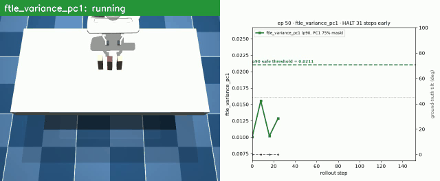
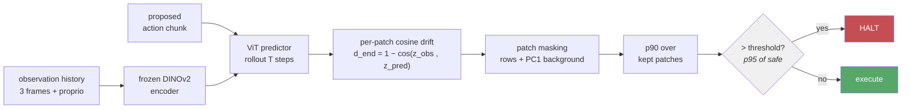
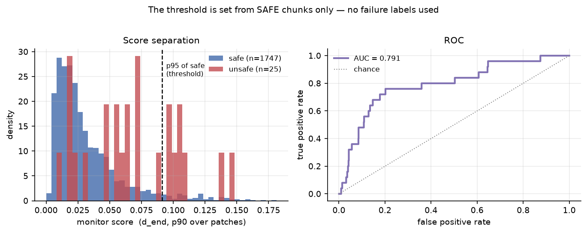
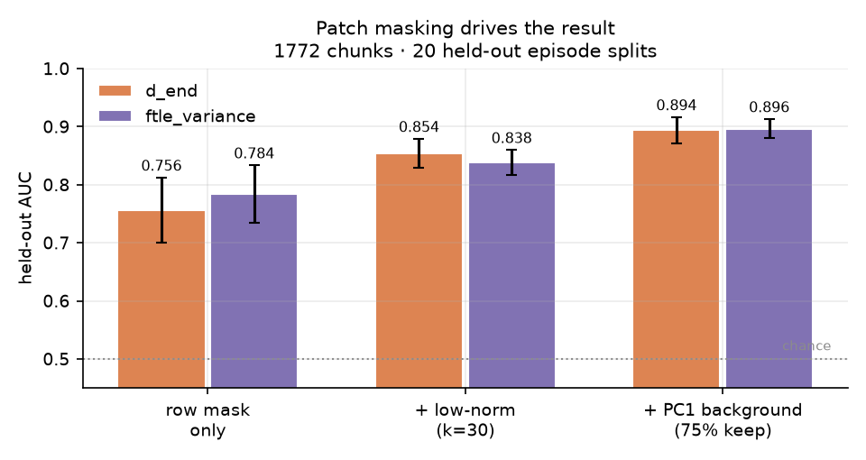
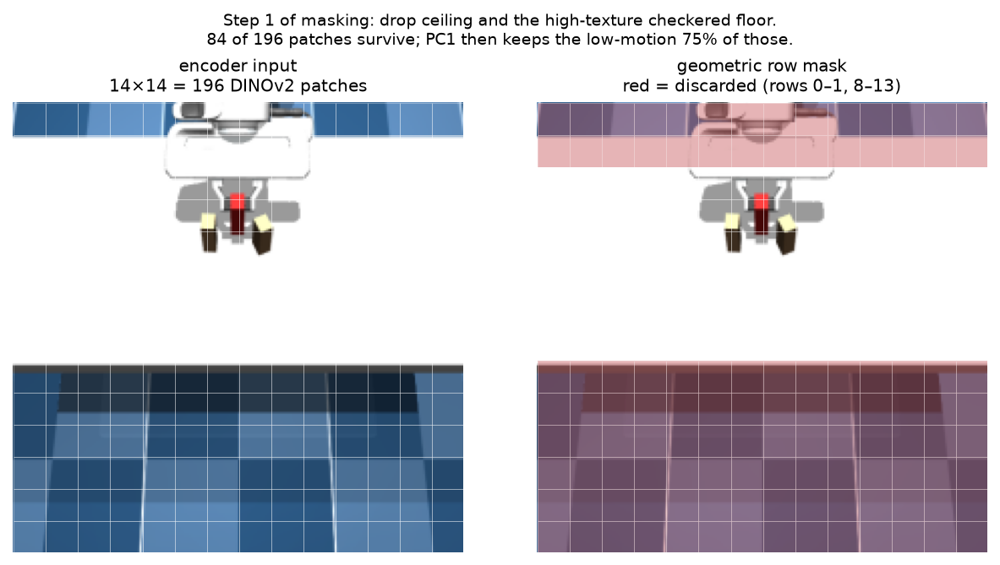
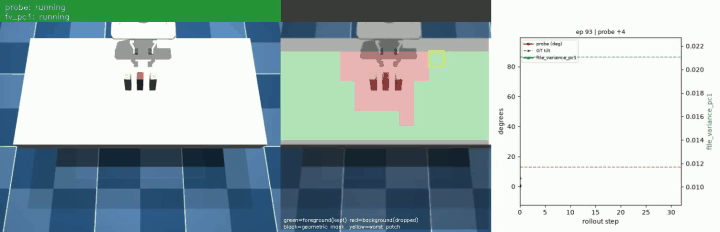
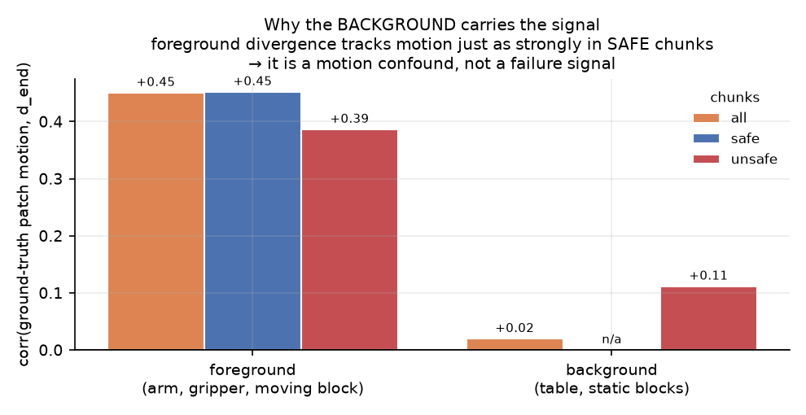
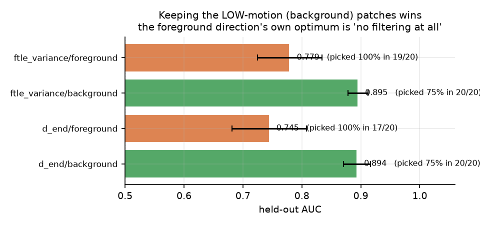
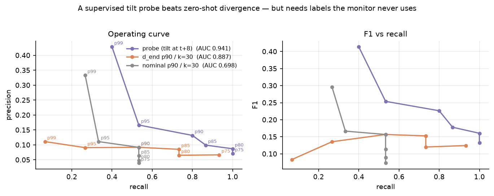
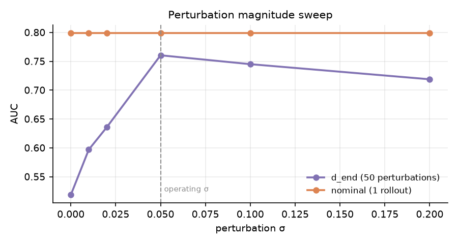

# stable_lyap_filters

> **Current research status (2026-09-22):** the goal is a task-agnostic runtime safety monitor:
> perturb the intended action with realistic execution error, roll the counterfactuals forward in a
> learned world model, and flag the action when the futures split. No task features and no failure
> labels in the monitor; Jenga is only the first testbed. On a frozen Jenga benchmark
> (`eval/jenga_bench.py`, 84 forks at 1x) the monitor works from privileged state (64% fork recall
> over 10 seeds; 88% ceiling) and from DINO images plus proprioception (67%). Ordinary world-model
> quality does not predict fork preservation. The forks the dynamics systematically miss are upright
> blocks pushed past their tipping angle ([blind_fork_analysis.md](blind_fork_analysis.md)). More
> training coverage of that transition does not fix it; a counterfactual training objective on the
> same data does (10 paired seeds: upright-fork miss rate 0.48 -> 0.25 at matched 5% FPR, matched
> recall 67% -> 84%, AUC 0.943 -> 0.974 with the intervention-consistency loss). **The plan being executed is
> [PLAN_NEXT.md](PLAN_NEXT.md)**; results are in [NOTES.md](NOTES.md). Nothing here is validated as
> a deployed safety filter, and universality has not yet been tested on a second task. The
> calibrated divergence monitor described below is a legacy baseline.

> **New here?** [**TOY_EXPERIMENT.md**](TOY_EXPERIMENT.md) explains the whole thing in plain terms
> with figures — the block, the physics, the monitor algorithm, and what we found.
>
> **Picking up the work?** [**HANDOFF.md**](HANDOFF.md) — method, current status, how to run
> everything, next steps. Then [MONITOR.md](MONITOR.md) for the method spec,
> [PLAN_NEXT.md](PLAN_NEXT.md) for the active plan, and [NOTES.md](NOTES.md) for the
> append-only decision log.

A **zero-shot safety monitor** for robot manipulation, needing **no labelled failures and no tuned
threshold**. It watches a policy's proposed action chunk and flags when the policy is operating
**near a boundary where small errors change the outcome**.

**It is a PROXIMITY monitor, not a failure detector** — and the distinction is load-bearing, not
pedantic. Proximity is actionable while there is still room to slow down, re-plan or ask for help;
failure prediction fires too late. Confidently-catastrophic actions are the easy case any crude
check catches (on the toy, summing the forces scores AUC 0.925 on outcome). The failures that
actually bite a demonstration-trained policy are the MARGINAL ones from OOD drift.

Task: a Franka Panda picks a block from a cluttered tabletop; failure is toppling a
neighbouring block. Everything runs on the latent dynamics of a **frozen DINO world model**.

> Current toy result with the shared PCA+HDBSCAN basin model and noise-excluded dissent: **episode
> AUC 0.869**, precision 0.889, recall 0.800, and F1 0.842 on 100 episodes using the preferred
> per-chunk label. On the old full-action label, the like-for-like AUC is **0.872 versus 0.882**
> previously. HDBSCAN discovers all three basins with 93.7% agreement, and 96-97% of large-margin
> chunks remain below alarm.
>
> The earlier **AUC 0.894** headline below is a different method and a different question --
> `d_end` magnitude with patch masking, scored on OUTCOME. It is kept because the record of what
> failed is the useful part.

<p align="center">
  <br>
  <em>The monitor halting 31 steps before a real topple. Left: the scene. Right: the score
  against a threshold set purely from safe episodes.</em>
</p>

The idea is Lyapunov-flavoured — ask whether the predicted future is *stable* under the
proposed actions — but the most useful content here is **which parts of that idea survived
contact with data and which did not.**

---

## How it works



Nothing in that path uses a failure label. The threshold is a percentile of the score
distribution on **safe** trajectories only, which is what makes the method zero-shot.

```python
from monitor import Monitor
mon = Monitor.load()                            # frozen DINO world model
mon.fit_pc1(safe_latents, motion=gt_motion)     # background mask; motion fixes the sign
mon.calibrate(safe_scores, percentile=95)       # threshold from SAFE chunks only
if mon.score(frames, proprio, actions) > mon.threshold:
    halt()
```

---

## Results

<p align="center"></p>

Unsafe chunks sit well to the right of the safe distribution, but the tails overlap — which
is why the operating point matters more than the AUC (see *Honest limits*).

### Patch masking is what actually drives performance

<p align="center"></p>

| configuration | AUC |
|---|---|
| `ftle` — the original (1/T)·log(d_end/d_start), max over patches *and* perturbations | 0.599 |
| `d_end`, p90 over patches, geometric row mask only | 0.756 |
| `d_end` + low-norm patch mask (k=30) | 0.854 |
| **`d_end` + PC1 background mask (75% keep)** | **0.894** |
| **`ftle_variance` + PC1 background mask** | **0.896** |

Mask type and hyperparameters are selected on one half of the episodes and scored on the
other, over 20 random splits.

<p align="center"></p>

---

## The three findings that made the difference

### 1. Drop the FTLE denominator

The original metric divides by `d_start`, measured one prediction step in — so it is tiny,
noisy, and ranks patches by how *quiet* they happened to start rather than how unstable they
are. Removing it is worth ~0.2 AUC. Taking a second maximum (over perturbations) is worse
still: an extremum over ~4100 values per chunk tracks tail noise. **0.599 → 0.799.**

<p align="center">
  
  <br>
  <em>Left: the fixed metric firing early on a topple. Right: a case the supervised probe
  catches and divergence misses — the residual gap discussed below.</em>
</p>

### 2. Mask *low*-norm patches, not high-norm ones

The intuitive suspect was DINOv2's high-norm artifact tokens. That was backwards:
`corr(‖z‖, d_end) = −0.641` on ground-truth-static patches. Cosine distance divides by ‖z‖,
so a near-featureless patch has a poorly-determined direction that wobbles under any
perturbation. **0.756 → 0.854.**

### 3. PC1 masking keeps the **background**, and that is why it works

<p align="center"></p>

On foreground patches (arm, gripper, moving block) `corr(motion, d_end) = +0.45` — and it is
just as strong in **safe** chunks (+0.452) as unsafe ones (+0.386). Most foreground divergence
is a *motion confound* from the always-moving arm, not a failure signal. Background patches
have ~zero baseline motion, so divergence there actually means something. **0.854 → 0.894.**

<p align="center"></p>

> ⚠️ **This was mislabelled in our own notes for a long time.** The foreground/background sign
> came from an unverified heuristic ("higher mean ‖z‖ = foreground") that turned out to be
> backwards on both datasets tested — `corr(PC1_raw, motion) = −0.479` and `−0.486`. **Resolve
> the sign against measured patch motion, never against norm.** `Monitor.fit_pc1(motion=...)`
> does this for you.

---

## Honest limits

**Never report accuracy.** At a 1.4% base rate, always predicting "safe" scores **98.6%** and
beats every real configuration. *(An earlier write-up of this work quoted 96.9% accuracy as a
headline; that number was an artifact of class imbalance.)*

Best operating point, `p95` threshold: **recall 0.52, precision 0.13, 0.88 false alarms per
episode.** Precision is capped by arithmetic — p95 admits ~88 false positives against 25
possible true positives, so it cannot exceed ~22%.

<p align="center"></p>

**A supervised probe beats it.** A linear probe on the *predicted* latent recovers future
block tilt at **AUC 0.941 vs divergence's 0.887** on identical chunks, and reaches 100% recall
at a loose threshold where no divergence configuration does. It needs tilt labels from sim
physics, so it is not zero-shot — but it bounds what the zero-shot framing costs, and shows
the information *is* linearly present in the latent. **The readout, not perception or
dynamics, is the bottleneck.**

**The 50-perturbation "deviator agent" may not earn its cost.**

<p align="center"></p>

A single unperturbed rollout (53 ms) matched the full 50-rollout apparatus (2021 ms) on one
dataset — difference not statistically significant. On a second dataset the ordering reversed.
Treat nominal-vs-perturbed as **dataset-dependent and unsettled**, not solved.

**Known failure modes.** "Flash topples" — blocks that fall with no precursor wobble — are an
information limit given a 3-frame history, not a metric weakness. Shadow and reflection
artifacts drive some false positives.

---

## Things that did NOT help

Documented so nobody spends a week rediscovering them. All held-out validated over 20 splits.

| idea | result |
|---|---|
| low-norm mask **and** PC1 mask combined | 0.887 / 0.892 — no gain; the selector picks "no low-norm filtering" in 12–19/20 splits. PC1 already removes the patches low-norm masking would. |
| temporal aggregation (rolling max/mean/EMA over chunk scores) | 0.880 / 0.887 — worse. At a 1.4% positive rate a rolling window mostly imports false-alarm surface from safe neighbours. |
| PCA feature-truncation (as opposed to patch selection) | did not survive cross-validation, despite a promising in-sample number |
| exact Jacobian FTLE (σ_max of ∂z_T/∂a) | correct but worse; the linear regime ends ~50× below the operating perturbation size |
| the FTLE ratio family generally | dominated (0.599 vs 0.894); no masking rescues the denominator |
| **using this score as a control objective** | actively harmful — see [`docs/HANDOFF.md`](docs/HANDOFF.md) |

That last one is worth a sentence: optimising actions *against* this score (rather than just
halting on it) raised the real topple rate 15% → 40% while successfully driving the score down
26%, and was statistically indistinguishable from random noise of the same magnitude. **A good
passive detector is not automatically a valid control objective.**

---

## Does it generalise?

Partially, and the pattern is informative. Two from-scratch 2D toy tasks, each with its own
physics and its own small world model:

| task | structure | AUC | background-vs-foreground finding |
|---|---|---|---|
| **Pusher2D** | moving pusher + normally-static fragile block — same shape as Jenga | **0.89** | **replicated** (bg 0.916 vs fg 0.649) |
| **CartPole** | no second object, no foreground/background split | ~0.55 | n/a |

So the method's strength appears tied to that specific scene structure rather than to
detecting dynamical instability in general. Worth stating that way rather than claiming
either extreme.

---

## Layout

```
src/monitor.py       the monitor: load → fit_pc1 → calibrate → score   (start here)
src/metrics.py       divergence metrics + patch masks, reasoning inline
src/paths.py         external repo locations from env vars, fails fast
eval/analyze.py      regenerates every table from results/
eval/make_figures.py regenerates every figure from results/
results/*.json       raw result files behind each table
media/               figures, videos, GIFs
docs/HANDOFF.md      state, traps that cost real time, prioritised next steps
```

Reproduce everything (no GPU, no model needed — just the JSON files):

```bash
python eval/analyze.py        # all tables
python eval/make_figures.py   # all figures
```

## Setup

For the transferred Jenga bundle, create an isolated environment and run the first fidelity gate:

```bash
./scripts/setup_env.sh
source .venv/bin/activate
python eval/jenga_j1_fidelity.py --episodes 10
```

The setup script reuses an existing CUDA PyTorch installation to avoid downloading a second
multi-gigabyte wheel. `requirements.txt` remains the fully pinned from-scratch environment.

```bash
export DINO_WM_DIR=/path/to/dino_wm                # world model + checkpoint
export PANDA_EXPRESS_DIR=/path/to/panda_express    # MuJoCo Jenga sim + episodes
export DINO_WM_CKPT=$DINO_WM_DIR/outputs/model_latest_single.pth
pip install -r requirements.txt
```

Python 3.10+ (DINOv2's hub code uses `X | None`). `SIM_HEADLESS=1` is required for any batch
run that imports the simulator — without it `sim.py` opens a viewer at import and core-dumps
on a machine with no display. `src/paths.py` resolves everything from those variables and
fails fast with a clear message if something is missing.
