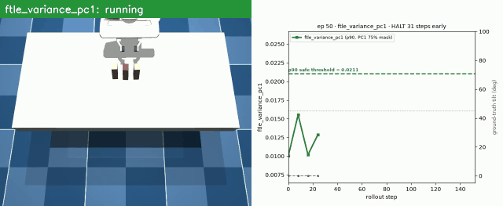
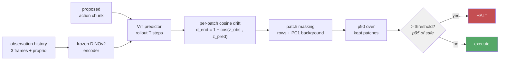
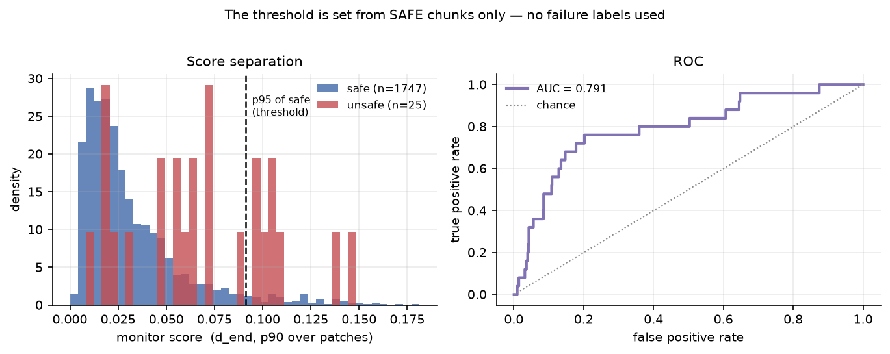
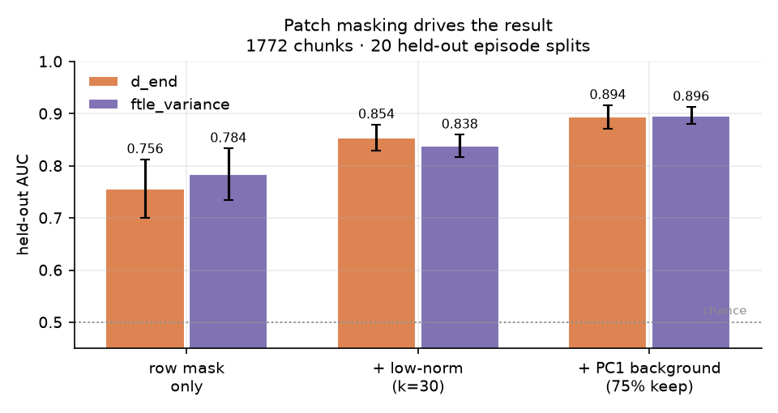
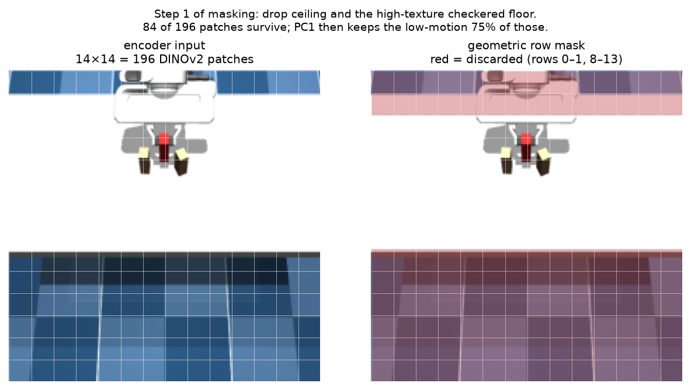
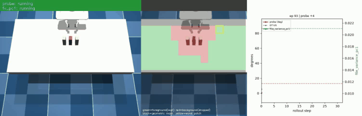
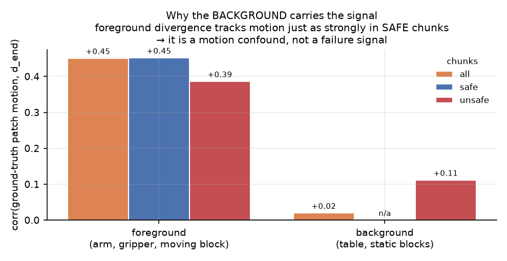
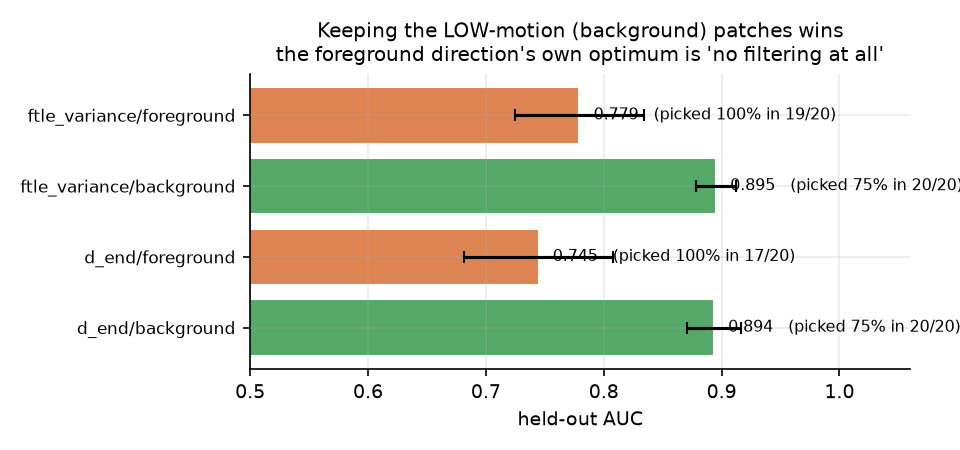
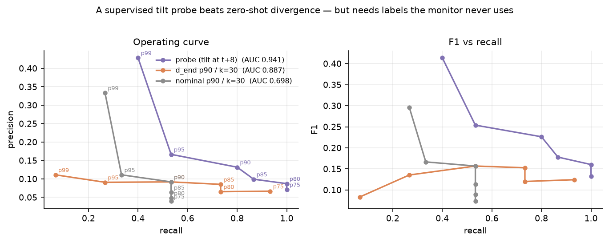
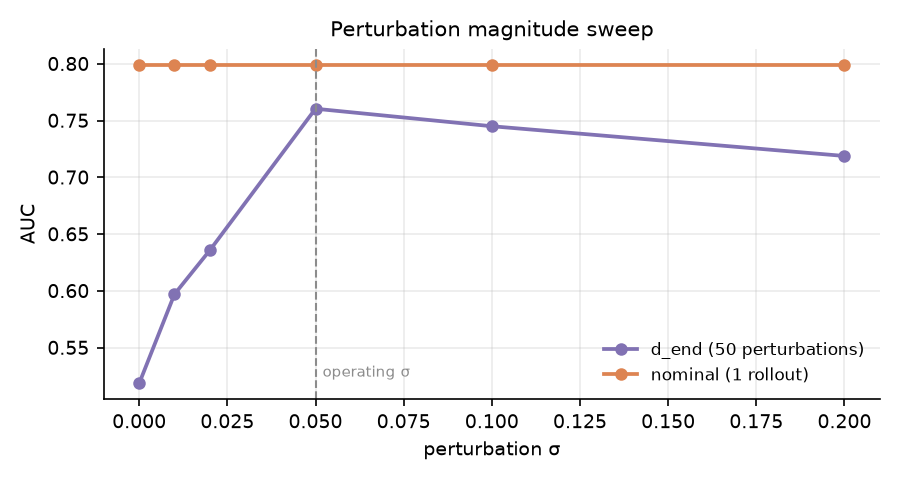

# stable_lyap_filters

## Current status

The active objective is a universal, task-label-free counterfactual safety monitor. The physical
monitor is validated across Jenga and upright pushing, but learned open-loop futures remain the
bottleneck. Deterministic relational training (D4) improved TRAIN geometry and failed matched DEV;
the complete-trajectory mixture (D5) did not improve commitment at its frozen TRAIN gate. The
current next step is therefore the re-observation/interface analysis in `PLAN_NEXT.md`, not another
Jenga-specific model or loss. TEST is closed to all new model selection.

The status blocks below are a reverse-chronological research record. Their historical “Next” lines
are superseded by this section and the active decision in `PLAN_NEXT.md`.

> **Latest multimodal result (2026-09-27):** D5 now implements a genuine three-mode complete-
> trajectory model rather than a per-step expert switch. Its modes do not collapse
> (41.5/20.1/38.5% occupancy), and it preserves the deterministic D4 monitor behavior on TRAIN
> validation, but it only improves topology by 0.95% while worsening commitment by 2.67%. It fails
> the prospectively frozen pilot gate, so no extra seeds or DEV/TEST evaluation were run. Combined
> with D4's matched DEV failure, this ends the current privileged Jenga architecture search. The
> next work should reassess the open-loop monitor/world-model interface, not tune another Jenga GNN.

> **Latest D4 replication and DEV result (2026-09-27):** on a larger 256-state TRAIN corpus and
> five fixed seeds, full-neighbourhood supervision reliably lowers topology and commitment error
> by 8.1% and 3.9% versus matched continuation while retaining frozen candidate recall. But it does
> **not** improve the frozen DEV monitor: median results are **8/23 topple, 3/89 quiet** versus
> matched continuation's **8/23, 2/89**, and physical-monitor agreement falls 77.1% -> 75.7%.
> Therefore D4 fails its preregistered DEV gate despite passing every TRAIN structural gate. TEST
> remains closed. Next test one multimodal trajectory architecture using the same universal,
> task-label-free supervision; do not tune this deterministic model or select its best seed.

> **Latest D4 result (2026-09-27):** full-neighbourhood relational supervision is implemented on
> a new TRAIN-only 48-state x 64-probe x 38-step corpus. In a matched seed-1 continuation gate,
> ordinary response training reduces branch-candidate recall from 0.80 to 0.40. Full D4 preserves
> 0.80 recall and improves frozen-D2 response/topology/commitment errors by 34.1%/4.5%/6.7%.
> Against matched continuation it lowers topology and commitment errors by 12.6% and 19.6%, at a
> 14.4% response-error cost. This is promising mechanism evidence from only seven held-out TRAIN
> states—not a DEV/TEST or deployable result. Replicate over seeds and a larger TRAIN panel next.

> **Latest crossover result (2026-09-27):** even when handed physically selected candidates and
> nested paths, D2 reaches only **4/23 topple and 5/89 quiet** alarms versus physical trajectories'
> **18/23 and 7/89**. On physically selected topple pairs, boundary agreement is 40.6%, commitment
> 59.4%, and persistence 95.7%. Together with the reverse crossover, this establishes two defects:
> D2 selects the wrong response pairs and predicts physically correct pairs poorly. Next train one
> model jointly on full-neighbourhood response topology and dense commitment trajectories, using
> physical monitor agreement rather than task labels. TEST remains closed.

> **Latest localization result (2026-09-27):** a dense 2×2 physical/D2 trajectory ablation finds
> that D2's selected action pairs are the primary failure. Replacing only boundary gaps changes
> **8/23 topple, 2/89 quiet** alarms to **9/23, 1/89**; replaying the same D2-selected pairs fully
> in physics gives **0/23** topple alarms. On topple pairs, D2/physical commitment agreement is only
> 25%, with D2 hallucinating commitment on 43/60 pairs. TEST remains closed. Next cross physical-
> selected versus D2-selected pair paths before designing topology-aware world-model supervision.

> **Latest DEV result (2026-09-27):** selective post-hoc scale correction fails its frozen gate.
> D2 gives **8/23 topple, 2/89 quiet** alarms; forced routing gives median **15/23, 4/89** and
> selective routing **15.5/23, 5/89**. A physical-future cost oracle over the same four options gets
> only **9/23, 4/89**, showing that the correction basis/objective itself lacks the required
> end-to-end tradeoff. Do not tune this router on DEV or run TEST. Next localize scale versus
> trajectory-consequence error with a trajectory-level physical oracle ablation.

> **Latest selective-router result (2026-09-27):** adding a no-correction option and predicting
> physical curve cost passes all frozen TRAIN-only gates. Across ten seeds it obtains **81.3%**
> persistent recall, **37.5%** smooth-case alarm FPR, **60.0%** future-oracle option accuracy, and
> recovers roughly **74%** of the oracle's curve-loss gain. This improves the prior forced router's
> 75% recall / 75% FPR tradeoff. The evidence is privileged-state TRAIN validation with only four
> smooth held-out groups; DEV and TEST were not touched. Next is a prospectively matched DEV test.

> **Latest causal-router result (2026-09-26):** the TRAIN-only router recovers substantial oracle
> signal—56.7% median mode accuracy, 68.8/70.8% of global/local oracle gain, and 75% persistent
> recall—but fails its prospective specificity gate with 75% median smooth-case alarm FPR. The
> future-informed oracle has 91.7% recall and 0% alarm FPR, so useful modes exist; the causal model
> cannot yet abstain from strong corrections on smooth inputs. DEV and TEST were not touched.

> **Latest architecture diagnosis (2026-09-26):** a prospectively fixed TRAIN-only oracle-routing
> upper bound shows that three reusable regimes can repair D2's missing nested-scale geometry. On
> 30 episode-disjoint held-out TRAIN groups, global/local scale loss falls **83.0%/65.4%**, and all
> modes are used (26.7/43.3/30.0%). The oracle sees the physical future, so this is not deployable
> performance. It moves all four strictly smooth predictions into an ambiguous middle band, but
> keeps them below the persistent/alarm threshold. Next is a causal balanced router tested entirely
> on TRAIN validation with explicit smooth specificity;
> DEV and TEST were not touched. See [HANDOFF.md](HANDOFF.md) and [PLAN_NEXT.md](PLAN_NEXT.md).

> **Panda pushing environment:** `src/systems/panda_block_push.py` uses the existing Panda
> operational-space controller to push one upright Jenga block into a planar goal. Success requires
> reaching the goal without ever toppling; complete success, upright overshoot, path-level topple
> and contact-loss previews are documented in
> [PANDA_BLOCK_PUSH.md](PANDA_BLOCK_PUSH.md). This is environment validation only; monitor and world
> model experiments intentionally come next.

> **Panda DEV monitor result:** a frozen 56-state physical panel now shows unchanged Regime Monitor
> v0 detecting **19/20** mixed upright/topple forks, with **0/15** alarms on stable centered pushes
> and **0/6** on upright overshoots. It also detects **5/5** maintained-versus-lost-contact regimes,
> as a universal structural monitor should. This is DEV evidence, not a held-out claim. Next is the
> same-panel physical-to-rendered-to-world-model representation test—not more task expansion.

> **Current research status (2026-09-23):** the goal is a task-agnostic runtime safety monitor:
> perturb the intended action with realistic execution error, roll the counterfactuals forward in a
> learned world model, and flag the action when the futures split. No task features and no failure
> labels in the monitor; Jenga is only the first testbed. On a frozen Jenga benchmark
> (`eval/jenga_bench.py`, 84 forks at 1x) the monitor works from privileged state (64% fork recall
> over 10 seeds; 88% ceiling) and from DINO images plus proprioception (67%). Ordinary world-model
> quality does not predict fork preservation. The forks the dynamics systematically miss are upright
> blocks pushed past their tipping angle ([blind_fork_analysis.md](blind_fork_analysis.md)). More
> training coverage of that transition does not fix it; a counterfactual training objective on the
> same data improves the *continuous spread ranking* (10 paired seeds: matched recall 67% -> 84%,
> AUC 0.943 -> 0.974). That result used a quiet-score threshold and is diagnostic only. The restored
> first calibration-free D2 monitor instead detects a persistent two-mode split using BIC,
> dimensionless Ashman's D and probe counts; over 10 seeds it gets 50.4% recall with 7.8% quiet
> alarms. A stronger action-conditioned smooth-versus-branch formulation has now been tested in the
> correct order. On matched simulator trajectories it gets **95.2% fork recall / 15.9% quiet
> alarms**; on the same pose coordinates and five times from 10 D2 seeds it gets **75.4% / 33.0%**.
> Thus the statistic sees real physical branching, while D2 erases some true branches and creates
> false ones. An eight-fold unseen-probe validation was also rejected on ground-truth DEV: recall
> fell 100% to 60.9% while quiet alarms barely changed (30.3% to 29.2%), so the false alarms are not
> primarily in-sample split overfitting. Both rules have no fit/calibrate step and see no quiet or
> failure examples. Adaptive midpoint refinement retains all 23 DEV forks and reduces quiet alarms
> from 30.3% to 23.6%, but still fails the <=5% gate. A generic full-state audit shows those retained
> quiet branches are physically real but far weaker than forks; the unresolved problem is universal
> consequence, not branch existence. The frozen one-resolution whole-trajectory rule, **Regime
> Monitor v0**, has now been run exactly once on untouched ground-truth TEST: **55/84 topple forks
> (65.5%)** and **4/113 quiet committed branches (3.5%)**. Candidate/boundary stages retain 78/84
> topples, while commitment/persistence is the main recall bottleneck. This supports v0 as a
> moderate-recall structural signal, not a standalone stop filter; TEST will not be used to tune it.
> Its fixed intervention wrapper has now passed a prospective 100-episode ground-truth test:
> neighboring-block failures fall **34 -> 25**, safe completions rise **51 -> 59**, and picks remain
> essentially unchanged (**80 -> 79**). Reobservation alone reaches only 31 failures and 53 safe
> completions; a privileged local oracle reaches 20 and 63. The paired wrapper gains are supported,
> but 97/100 episodes receive at least one of the 275 one-step reobservations, so the policy remains
> conservative. That cross-task experiment is now complete and **fails**: on untouched
> ground-truth TEST, unchanged v0 alarms on **0/12 pushing** and **0/11 insertion** consequential
> forks (quiet alarms 3/108 and 0/109). The candidate stage sees the forks, but the Jenga-derived
> commitment clause rejects them. A 100-episode-per-task intervention follow-up is inconclusive
> because its baseline population accidentally contains zero terminal failures; it is preserved as
> a benchmark-design failure, not reported as a safety success. Next: a new, prospectively frozen
> transition-law/contact-graph monitor on cross-task DEV plus a natural-episode coverage gate with
> terminal settling—not further Jenga tuning. **The
> plan being executed is [PLAN_NEXT.md](PLAN_NEXT.md)**; results are in [NOTES.md](NOTES.md). Nothing here is validated as
> a deployed safety filter, and universality has not yet been tested on a second task. The
> calibrated divergence monitor described below is a legacy baseline.

> **New here?** [**TOY_EXPERIMENT.md**](TOY_EXPERIMENT.md) explains the whole thing in plain terms
> with figures — the block, the physics, the monitor algorithm, and what we found.
> [**JENGA_3D_TASKS.md**](JENGA_3D_TASKS.md) is the concise, visual presentation page for the 3D
> Jenga pick and upright-push experiments, including successes, failures, monitor evidence, current
> world-model status, and next steps.
>
> **Picking up the work?** [**HANDOFF.md**](HANDOFF.md) — method, current status, how to run
> everything, next steps. Then [MONITOR.md](MONITOR.md) for the method spec,
> [PLAN_NEXT.md](PLAN_NEXT.md) for the active plan, and [NOTES.md](NOTES.md) for the
> append-only decision log.

A **zero-shot safety monitor** for robot manipulation, needing **no labelled failures and no tuned
threshold**. It watches a policy's proposed action chunk and flags when the policy is operating
**near a boundary where small errors change the outcome**.

**It is a PROXIMITY monitor, not a failure detector** — and the distinction is load-bearing, not
pedantic. Proximity is actionable while there is still room to slow down, re-plan or ask for help;
failure prediction fires too late. Confidently-catastrophic actions are the easy case any crude
check catches (on the toy, summing the forces scores AUC 0.925 on outcome). The failures that
actually bite a demonstration-trained policy are the MARGINAL ones from OOD drift.

Task: a Franka Panda picks a block from a cluttered tabletop; failure is toppling a
neighbouring block. Everything runs on the latent dynamics of a **frozen DINO world model**.

> Current toy result with the shared PCA+HDBSCAN basin model and noise-excluded dissent: **episode
> AUC 0.869**, precision 0.889, recall 0.800, and F1 0.842 on 100 episodes using the preferred
> per-chunk label. On the old full-action label, the like-for-like AUC is **0.872 versus 0.882**
> previously. HDBSCAN discovers all three basins with 93.7% agreement, and 96-97% of large-margin
> chunks remain below alarm.
>
> The earlier **AUC 0.894** headline below is a different method and a different question --
> `d_end` magnitude with patch masking, scored on OUTCOME. It is kept because the record of what
> failed is the useful part.

<p align="center">
  <br>
  <em>The monitor halting 31 steps before a real topple. Left: the scene. Right: the score
  against a threshold set purely from safe episodes.</em>
</p>

The idea is Lyapunov-flavoured — ask whether the predicted future is *stable* under the
proposed actions — but the most useful content here is **which parts of that idea survived
contact with data and which did not.**

---

## How it works


```mermaid
flowchart LR
    A["observation history<br/>3 frames + proprio"] --> B["frozen DINOv2<br/>encoder"]
    A2["proposed<br/>action chunk"] --> C
    B --> C["ViT predictor<br/>rollout T steps"]
    C --> D["per-patch cosine drift<br/>d_end = 1 − cos(z_obs , z_pred)"]
    D --> E["patch masking<br/>rows + PC1 background"]
    E --> F["p90 over<br/>kept patches"]
    F --> G{"> threshold?<br/><i>p95 of safe</i>"}
    G -- yes --> H["HALT"]
    G -- no --> I["execute"]
    style H fill:#C44E52,color:#fff
    style I fill:#55A868,color:#fff
    style G fill:#f0f0f0
```

Nothing in that path uses a failure label. The threshold is a percentile of the score
distribution on **safe** trajectories only, which is what makes the method zero-shot.

```python
from monitor import Monitor
mon = Monitor.load()                            # frozen DINO world model
mon.fit_pc1(safe_latents, motion=gt_motion)     # background mask; motion fixes the sign
mon.calibrate(safe_scores, percentile=95)       # threshold from SAFE chunks only
if mon.score(frames, proprio, actions) > mon.threshold:
    halt()
```

---

## Results

<p align="center"></p>

Unsafe chunks sit well to the right of the safe distribution, but the tails overlap — which
is why the operating point matters more than the AUC (see *Honest limits*).

### Patch masking is what actually drives performance

<p align="center"></p>

| configuration | AUC |
|---|---|
| `ftle` — the original (1/T)·log(d_end/d_start), max over patches *and* perturbations | 0.599 |
| `d_end`, p90 over patches, geometric row mask only | 0.756 |
| `d_end` + low-norm patch mask (k=30) | 0.854 |
| **`d_end` + PC1 background mask (75% keep)** | **0.894** |
| **`ftle_variance` + PC1 background mask** | **0.896** |

Mask type and hyperparameters are selected on one half of the episodes and scored on the
other, over 20 random splits.

<p align="center"></p>

---

## The three findings that made the difference

### 1. Drop the FTLE denominator

The original metric divides by `d_start`, measured one prediction step in — so it is tiny,
noisy, and ranks patches by how *quiet* they happened to start rather than how unstable they
are. Removing it is worth ~0.2 AUC. Taking a second maximum (over perturbations) is worse
still: an extremum over ~4100 values per chunk tracks tail noise. **0.599 → 0.799.**

<p align="center">
  
  <br>
  <em>Left: the fixed metric firing early on a topple. Right: a case the supervised probe
  catches and divergence misses — the residual gap discussed below.</em>
</p>

### 2. Mask *low*-norm patches, not high-norm ones

The intuitive suspect was DINOv2's high-norm artifact tokens. That was backwards:
`corr(‖z‖, d_end) = −0.641` on ground-truth-static patches. Cosine distance divides by ‖z‖,
so a near-featureless patch has a poorly-determined direction that wobbles under any
perturbation. **0.756 → 0.854.**

### 3. PC1 masking keeps the **background**, and that is why it works

<p align="center"></p>

On foreground patches (arm, gripper, moving block) `corr(motion, d_end) = +0.45` — and it is
just as strong in **safe** chunks (+0.452) as unsafe ones (+0.386). Most foreground divergence
is a *motion confound* from the always-moving arm, not a failure signal. Background patches
have ~zero baseline motion, so divergence there actually means something. **0.854 → 0.894.**

<p align="center"></p>

> ⚠️ **This was mislabelled in our own notes for a long time.** The foreground/background sign
> came from an unverified heuristic ("higher mean ‖z‖ = foreground") that turned out to be
> backwards on both datasets tested — `corr(PC1_raw, motion) = −0.479` and `−0.486`. **Resolve
> the sign against measured patch motion, never against norm.** `Monitor.fit_pc1(motion=...)`
> does this for you.

---

## Honest limits

**Never report accuracy.** At a 1.4% base rate, always predicting "safe" scores **98.6%** and
beats every real configuration. *(An earlier write-up of this work quoted 96.9% accuracy as a
headline; that number was an artifact of class imbalance.)*

Best operating point, `p95` threshold: **recall 0.52, precision 0.13, 0.88 false alarms per
episode.** Precision is capped by arithmetic — p95 admits ~88 false positives against 25
possible true positives, so it cannot exceed ~22%.

<p align="center"></p>

**A supervised probe beats it.** A linear probe on the *predicted* latent recovers future
block tilt at **AUC 0.941 vs divergence's 0.887** on identical chunks, and reaches 100% recall
at a loose threshold where no divergence configuration does. It needs tilt labels from sim
physics, so it is not zero-shot — but it bounds what the zero-shot framing costs, and shows
the information *is* linearly present in the latent. **The readout, not perception or
dynamics, is the bottleneck.**

**The 50-perturbation "deviator agent" may not earn its cost.**

<p align="center"></p>

A single unperturbed rollout (53 ms) matched the full 50-rollout apparatus (2021 ms) on one
dataset — difference not statistically significant. On a second dataset the ordering reversed.
Treat nominal-vs-perturbed as **dataset-dependent and unsettled**, not solved.

**Known failure modes.** "Flash topples" — blocks that fall with no precursor wobble — are an
information limit given a 3-frame history, not a metric weakness. Shadow and reflection
artifacts drive some false positives.

---

## Things that did NOT help

Documented so nobody spends a week rediscovering them. All held-out validated over 20 splits.

| idea | result |
|---|---|
| low-norm mask **and** PC1 mask combined | 0.887 / 0.892 — no gain; the selector picks "no low-norm filtering" in 12–19/20 splits. PC1 already removes the patches low-norm masking would. |
| temporal aggregation (rolling max/mean/EMA over chunk scores) | 0.880 / 0.887 — worse. At a 1.4% positive rate a rolling window mostly imports false-alarm surface from safe neighbours. |
| PCA feature-truncation (as opposed to patch selection) | did not survive cross-validation, despite a promising in-sample number |
| exact Jacobian FTLE (σ_max of ∂z_T/∂a) | correct but worse; the linear regime ends ~50× below the operating perturbation size |
| the FTLE ratio family generally | dominated (0.599 vs 0.894); no masking rescues the denominator |
| **using this score as a control objective** | actively harmful — see [`docs/HANDOFF.md`](docs/HANDOFF.md) |

That last one is worth a sentence: optimising actions *against* this score (rather than just
halting on it) raised the real topple rate 15% → 40% while successfully driving the score down
26%, and was statistically indistinguishable from random noise of the same magnitude. **A good
passive detector is not automatically a valid control objective.**

---

## Does it generalise?

Partially, and the pattern is informative. Two from-scratch 2D toy tasks, each with its own
physics and its own small world model:

| task | structure | AUC | background-vs-foreground finding |
|---|---|---|---|
| **Pusher2D** | moving pusher + normally-static fragile block — same shape as Jenga | **0.89** | **replicated** (bg 0.916 vs fg 0.649) |
| **CartPole** | no second object, no foreground/background split | ~0.55 | n/a |

So the method's strength appears tied to that specific scene structure rather than to
detecting dynamical instability in general. Worth stating that way rather than claiming
either extreme.

---

## Layout

```
src/monitor.py       the monitor: load → fit_pc1 → calibrate → score   (start here)
src/metrics.py       divergence metrics + patch masks, reasoning inline
src/paths.py         external repo locations from env vars, fails fast
eval/analyze.py      regenerates every table from results/
eval/make_figures.py regenerates every figure from results/
results/*.json       raw result files behind each table
media/               figures, videos, GIFs
docs/HANDOFF.md      state, traps that cost real time, prioritised next steps
```

Reproduce everything (no GPU, no model needed — just the JSON files):

```bash
python eval/analyze.py        # all tables
python eval/make_figures.py   # all figures
```

## Setup

For the transferred Jenga bundle, create an isolated environment and run the first fidelity gate:

```bash
./scripts/setup_env.sh
source .venv/bin/activate
python eval/jenga_j1_fidelity.py --episodes 10
```

The setup script reuses an existing CUDA PyTorch installation to avoid downloading a second
multi-gigabyte wheel. `requirements.txt` remains the fully pinned from-scratch environment.

```bash
export DINO_WM_DIR=/path/to/dino_wm                # world model + checkpoint
export PANDA_EXPRESS_DIR=/path/to/panda_express    # MuJoCo Jenga sim + episodes
export DINO_WM_CKPT=$DINO_WM_DIR/outputs/model_latest_single.pth
pip install -r requirements.txt
```

Python 3.10+ (DINOv2's hub code uses `X | None`). `SIM_HEADLESS=1` is required for any batch
run that imports the simulator — without it `sim.py` opens a viewer at import and core-dumps
on a machine with no display. `src/paths.py` resolves everything from those variables and
fails fast with a clear message if something is missing.

Latest calibration-free ground-truth result (2026-09-22): the action-branch plus 32x boundary
refinement finds all 23 DEV topple forks but also 21/89 quiet states. A follow-up that removes static
pose offsets and asks whether the two sides require different pose/velocity transition laws is very
specific but misses the phenomenon: **4/23 forks, 1/89 quiet**. The result supports an important
distinction for the universal monitor: different consequential futures can obey the same underlying
physics. See `PLAN_NEXT.md` and `results/jenga/shared_dynamics_ground_truth_dev.json`; TEST and D2
were intentionally not run.

The subsequent calibration-free boundary + amplification + persistence test was also evaluated on
ground-truth DEV. It is highly specific (**2/89 quiet alarms**) but detects only **3/23 topple
forks**. Boundary scaling and persistence each retain all 23 forks; the failed assumption is that a
consequential difference must continue growing after H=8. Most topples become committed during the
action and then persist or settle. The next ground-truth rule must measure action-to-consequence
gain over the complete action-and-hold trajectory. See
`results/jenga/consequence_ground_truth_dev.json`.

Allowing a penalized commitment event anywhere during H=8 or the first five hold steps substantially
improves the ground-truth result to **18/23 topple forks and 7/89 quiet alarms**. This confirms that
the relevant transition often occurs during the action, but the frozen >=21/23 and <=4/89 gate still
fails. No threshold was tuned, and TEST/D2 remain untouched. The next control is multi-resolution:
record dense trajectories at every action-bisection level and require commitment timing and shape to
converge as the bracket narrows. Result: `results/jenga/whole_trajectory_consequence_dev.json`.

That dense six-width convergence test is now complete and is too strict: **2/23 topple forks and
1/89 quiet alarms**. Shape convergence is present on a majority of refined pairs for only 6/23
topple states. Approaching a hybrid physical boundary does not guarantee stable finite-resolution
event timing or trajectory shape, even when the outcome split and late persistence are real. The
best frozen structural result remains 18/23 and 7/89. The remaining research decision is whether to
add a generic, cross-task physical-severity concept or count all real committed regime changes as
valid interventions. See `results/jenga/multiresolution_consequence_dev.json`.

A follow-up local-recoverability test applies seven bounded corrective actions from each branch and
asks whether their reachable sets overlap. It gets **15/23 topple forks and 12/89 quiet alarms**;
recoverability is neither necessary nor sufficient for the topple label. Harmless static changes can
be locally irreversible, while some topple branches have overlapping sampled reachable sets. No
correction radius was tuned. Result: `results/jenga/recoverability_ground_truth_dev.json`.

The selected structural detector is frozen as **Regime Monitor v0**. Verify its implementation,
constants and data identity before any new evaluation:

```bash
python eval/jenga_regime_monitor_v0_freeze.py verify
```

Frozen protocol SHA-256:
`4e1a20ca3c64bf18733315fe31df5850529027f8f48cda2c5f547ce43ecdc317`.

The one-time ground-truth TEST result is
`results/jenga/regime_monitor_v0/test_ground_truth.json`: 55/84 topple forks and 4/113 quiet
committed branches. It is immutable and must not be used to revise v0. See
`results/jenga/regime_monitor_v0/test_ground_truth_analysis.json` for confidence intervals,
stage attrition and intervention burden.

The prospectively frozen intervention wrapper then reduced neighbor failures from 34/100 to 25/100
and raised safe completions from 51/100 to 59/100, with pick success 80/100 to 79/100. See
`results/jenga/intervention_v0/ground_truth_100.json` and
`results/jenga/intervention_v0/analysis.json`. This establishes ground-truth Jenga utility, not
cross-task universality or world-model readiness.

Timing is modest: on common successful episodes, the wrapper adds 0.23 s on average and 0.2 s at
the median to the first pick criterion. Pushing and insertion mechanism environments now exist in
`src/systems/contact_benchmarks.py`; inspect [CONTACT_BENCHMARKS.md](CONTACT_BENCHMARKS.md) and
`results/contact_benchmarks/previews/`. They are design prototypes awaiting prospective execution-
noise and split freeze, not cross-task monitor results yet.

The Panda upright-push DEV panel now separates monitor validity from visual transfer. Physical v0
detects 19/20 mixed upright/topple forks and is quiet on all 15 stable centered pushes. On the exact
same rendered true futures, the first fixed full-frame DINO adapter agrees with physical decisions
on only 33/56 states and recovers 6/19 physical mixed-fork alarms. This fails the representation
gate before any world-model prediction is involved. See `PANDA_BLOCK_PUSH.md` and
`results/panda_block_push/visual_v0/visual_v0_diagnostic.json`; the next experiment is fixed
background suppression followed by a segmented block-region diagnostic upper bound, not world-model
training.

An unlabeled per-state PCA45 replacement improves that visual baseline to 37/56 agreement and
10/19 recovered physical mixed-fork alarms, showing that random projection lost useful commitment
structure. It still flags all 56 states as initial candidates and misses every physical contact-loss
alarm, so the representation gate remains failed. Continue with background-suppressed and
object-region readouts before evaluating predicted futures.

That ladder is now complete. RGB-change weighting worsens agreement to 30/56. Oracle
simulator-segmented block features recover 21/25 physical alarms but produce 21 visual-only alarms,
including 10/15 stable pushes. Therefore the task-relevant signal is present in object-centric
visual features, but the current PCA-to-physical-v0 adapter is not specific. The next step is a
visual-native object-trajectory consequence measure; world-model prediction remains deferred.

The proper visual-native consequence stage is now implemented. With segmented block features it
recovers 24/25 physical alarms (18/19 mixed forks and all five contact-loss regimes), confirming
that rendered futures contain the signal. It also produces 18 visual-only alarms because ordinary
object motion is nonsmooth in the current DINO/PCA response coordinates. The remaining task is
upstream visual geometry/patch tracking, not physical-channel emulation or consequence redesign.

A first universal DINO patch-correspondence arm is also negative: matched patch positions and
velocities recover only 10/25 physical alarms with eight extras, and all 56 states remain initial
candidates. The coarse 16x16 semantic grid is not a stable dynamics tracker. The next representation
test should use higher-resolution temporal point tracking or optical flow, without tuning this
matcher on DEV.

That high-resolution optical-flow test is now complete and also negative. Generic corner tracks
recover 24/25 physical alarms, but alarm on 54/56 states and add 30 alarms beyond physical v0,
including every safe-centered and overshoot state. Track visibility remains high; the failure is
not primarily lost points. Full-image 2-D motion conflates benign robot/contact/perspective changes
with physical branching. Do not tune this DEV result. The next step is a label-free,
dynamics-trained object-centric or 3-D equivariant representation, frozen before evaluation on a
new Panda TEST split; world-model predictions remain deferred. See `PANDA_BLOCK_PUSH.md` and
`results/panda_block_push/optical_flow/optical_flow_diagnostic.json`.

The label-free slot-dynamics pipeline and separate 2,720-frame TRAIN/validation set are now built.
Three prospectively frozen slot variants fail before monitor scoring: appearance slots remain
uniform, motion slots collapse to one slot, and balanced motion slots remain nearly static. The
strongest v2 has eight effective slots and 0.337 motion-map correlation but only 0.000240 temporal
geometry RMS, failing its frozen 0.002 gate. Consequently no monitor DEV/TEST result was opened.
Next add generic optical/scene-flow or depth-track supervision for persistent entity trajectories;
keep all failure and simulator-state labels excluded. Details and manifests are in
`PANDA_BLOCK_PUSH.md` and `results/panda_block_push/slot_dynamics/`.

Ground-truth cross-task validation has meanwhile advanced. A newly generated and prospectively
frozen upright-pushing TEST gets 14/20 mixed topple forks (70%), 0/15 stable-centered alarms, 3/5
contact-loss alarms, 0/6 overshoot alarms and 1/10 unanimous-topple alarms. This is below the 19/20
DEV fork result but consistent with the monitor's 65.5% held-out Jenga recall and high quiet
specificity. Ten exact alarm-pair videos from each task are in
`results/ground_truth_monitor_alarm_videos/`. See `PANDA_BLOCK_PUSH.md` for protocol/result hashes.

The final frozen monitor has also now been run on the ten existing D2 state-GNN world models. This
is the exact learned-future experiment, not another training proposal: D2 predicts all coarse
probes, five adaptive midpoint refinements and final trajectories. Mean Jenga TEST topple recall is
31.1% (8.3-48.8%) with 1.95% quiet alarms (0-5.3%), compared with physical-future v0 at 65.5% and
3.5%. Most signal is lost at local boundary refinement (63.3 initial candidates -> 32.5 refined
boundaries on average; physical 80 -> 78), showing that the current learned dynamics do not preserve
action-width scaling reliably. See `results/jenga/regime_monitor_v0/d2/aggregate.json`.

The matched ten-seed D1 control is more sensitive but less selective: 44.6% mean topple recall
(29.8-60.7%) and 4.78% quiet alarms (1.8-8.8%). D1 retains 46.1 refined topple boundaries on average
and its median topple final/initial gap ratios are 0.263/0.727 (early/full), versus D2's 0.074/0.097
and physical futures' 0.997/0.997. Quiet ratios remain near the smooth 1/32 law. Thus finite
pair-distance supervision partly restores persistent branches but does not cleanly separate true
physical plateaus from false ones. See `results/jenga/regime_monitor_v0/d1/aggregate.json`.

D3 boundary-scale supervision has now completed its first matched TRAIN/DEV pilot. The task-label-
free 256-state dataset contains both smooth and persistent physical scale curves, but the continuous
deterministic GNN learns the smooth contraction more readily. Against a three-epoch D2 continuation
control, frozen-v0 DEV performance falls from 10/23 to 3/23 topple alarms while quiet alarms rise
from 1/89 to 3/89. TEST was not touched and D3 should not be expanded in this form. Hard contact
feedback recovers 11/23 topples but produces 13/89 quiet alarms, motivating a *selective learned
hybrid mode* rather than another loss reweighting on the same continuous architecture. See
`results/jenga/d3_pilot_summary.json`, `src/boundary_scale_loss.py` and `eval/jenga_d3_data.py`.

The follow-up switching-edge architecture is implemented as `StepSwitchingEdgeGNN`. It places a
persistent categorical latent mode on every directed graph edge and uses mode-specific interaction
messages while keeping shared state/contact heads. The latent modes receive no semantic, failure or
task labels. Training supports anti-collapse balance, decisive-mode entropy and temporal-
persistence regularization, together with the existing D2 and D3 objectives. Use
`eval/jenga_w6_simple.py --model edge_switch --modes 3 ...`. Unit and full-horizon smoke tests pass;
no DEV or TEST performance claim has been made yet.

The prospectively matched one-seed DEV screen is now complete. Soft D2 scores 10/23 topple alarms
and 1/89 quiet alarms; hard-contact D2 scores 11/23 and 9/89; switching D2 scores 4/23 and 1/89;
switching+D3 scores 4/23 and 2/89. Both switching arms fail the predeclared >=10/23, <=3/89 gate.
The no-D3 gate remains nearly uniform and resolves to one argmax mode, while D3 collapses outright
to one mode. This rejects the present routing/training formulation, not the general hybrid-model
idea. TEST remains untouched. See `results/jenga/switching_edge_four_arm_summary.json`.
