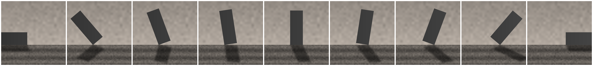
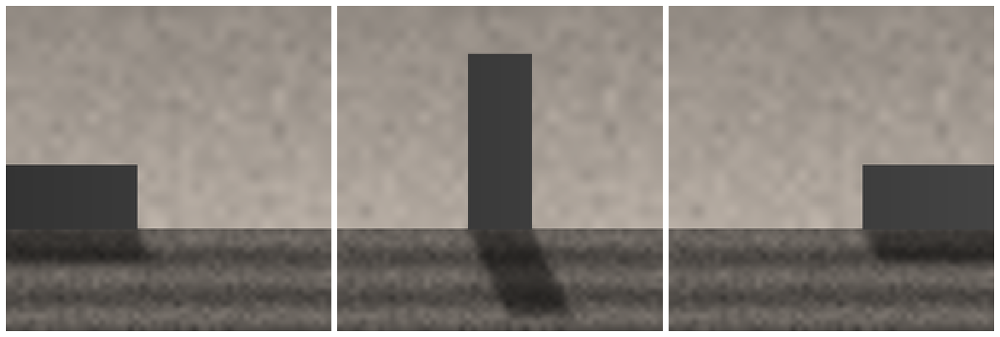
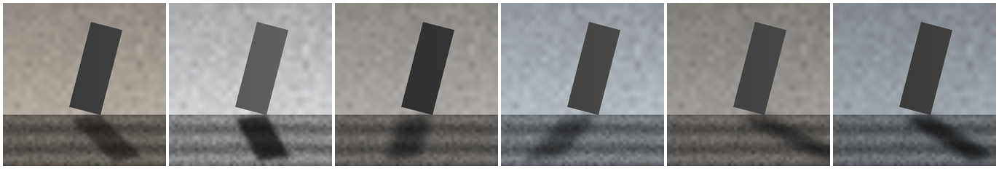
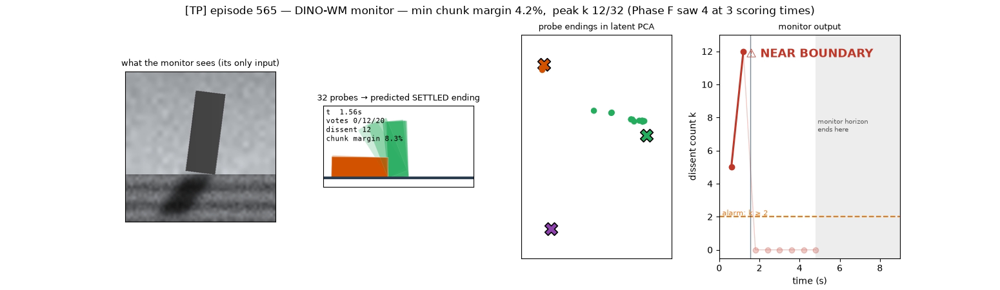
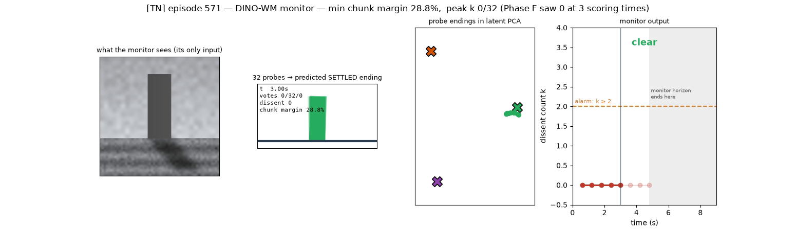
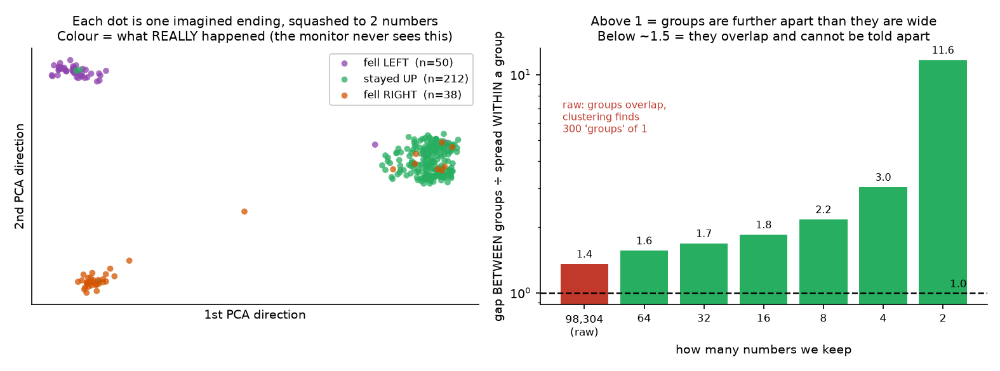
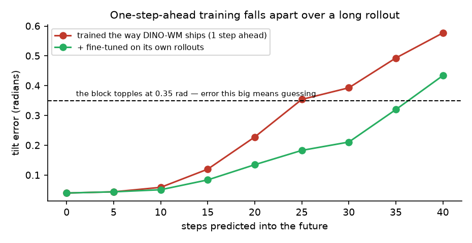
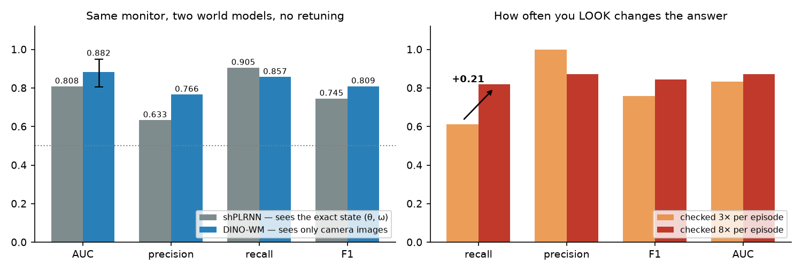

# The toy experiment, explained simply

**What we were trying to find out:** does our safety monitor still work when the world model only
gets to look at *camera images*, instead of being handed the exact state of the world?

That matters because on the real Jenga task there is no exact state — only pixels. But on the real
task we also cannot check our answers, because nobody knows the true "how close to disaster was
that?" number. So we built a toy where we *can* check, swapped the world model, and looked.

**Short answer: yes.** The image-based version matched the version that reads the exact state,
using identical settings and no re-tuning.

---

## 1. The toy: a block that can tip over

A rectangular block standing on a table. You push it horizontally. It rocks on one bottom corner,
slams back down, rocks the other way. Push hard enough and it topples — and once it's down, it
stays down.



*From fallen-left, through upright, to fallen-right. It pivots on a corner, like a real toppling
object.*

We picked this because it has the one property the real Jenga task has and most toy problems
don't: **failure is irreversible**. A toppled block never un-topples. That makes "did it fail?" a
genuine fork in the road rather than a temporary wobble.

### The exact dynamics

This is the classical **rocking block** of Housner (1963) [1], the standard model for exactly the
Jenga question: how hard can you push a free-standing block before it goes over?

Let **θ** be the tilt angle (0 = flat on its base) and **ω = θ̇** the rotation speed. Rocking about
a corner, with a horizontal force *F* applied at the centre of mass:

```
    I_O · θ̈  =  F·R·cos(α − θ)  −  m·g·R·sin(α − θ)        with  I_O = (4/3)·m·R²
```

We set m = g = R = 1, so the only shape parameter is **α**, the block's *slenderness*:

```
    α = atan(half-width / half-height) = 0.35 rad ≈ 20°
```

With I_O = (4/3)mR², the acceleration simplifies to **θ̈ = (3/4)·[F·cos(α−θ) − g·sin(α−θ)]**, and
the system has **two guards** — moments where the smooth equation stops applying:

| guard | condition | what happens |
|---|---|---|
| **impact** | θ = 0 | the block slams onto its base and rocks the other way, losing speed: ω ← e_r·ω with Housner's restitution **e_r = 1 − 1.5·sin²α = 0.824** |
| **topple** | \|θ\| = α | the centre of mass passes over the pivot. Past this point gravity *drives* the rotation instead of restoring it — the fall is committed and irreversible |

Two more useful numbers: the block won't move at all unless the push exceeds the **critical force
g·tan(α) = 0.365**, and once committed it takes ~164 simulation steps (3.3 s) to actually reach
the ground. That gap between *committed* and *fallen* matters — it's why the monitor has to imagine
far enough ahead.

### The state, for the model that gets to cheat

The whole system is described by **two numbers: (θ, ω)** — tilt and rotation speed. That is exactly
what the state-based model is handed. It's a complete description: given (θ, ω) and the forces, the
future is fully determined.

**The image-based model gets neither.** It gets a picture. A single photo shows θ but says nothing
about ω — you cannot see speed in a still image — which is why it needs **three consecutive
frames** to work out how fast the block is rocking.

### There are exactly three ways it can end



Fallen left, still standing, fallen right. These are the **attractors** — the states the system
comes to rest in. The monitor's entire job is to notice when nearby actions lead to *different*
ones.

### We deliberately made it harder than it needed to be

Every episode gets its own lighting: different lamp direction, shadow length, brightness, block
shade.



*All six are the **same block at the same angle**. Only the lighting changed.*

Why sabotage ourselves? Because shadows are the known weak point of the real Jenga monitor — the
world model predicts them inconsistently and that causes false alarms. Putting that problem into a
system where we *can* measure the truth is the point of having a toy.

---

## 2. The monitor, explicitly

It never asks *"will this fail?"* It asks:

> **"If I nudge this action slightly, does the world end up somewhere different?"**

If yes, you're balanced on a knife edge — small errors change the outcome, and that is worth
knowing *now*, while there's still time to slow down or ask for help.

### The algorithm

```
GIVEN:  the last 3 camera frames, and the action chunk the robot is about to execute
        a set of attractor centres C (found offline, see §5)

 1.  a  ←  the next H = 20 steps of the planned action          (fixed horizon, never shrinking)

 2.  for j = 1 … 32:                                            ← 32 probes
         z_j ~ Normal(0, 1)                                     ← ONE random number per probe
         a_j ←  a · (1 + ε·z_j)      with ε = 0.10              ← same push, scaled up or down

 3.  append 40 steps of ZERO force to every a_j                 ← the "settle tail": stop pushing
                                                                  and let the block come to rest

 4.  roll each a_j through the world model from the current
     frames; keep only the FINAL latent state E_j

 5.  squash every E_j down to 8 numbers (PCA)                   ← see §5 for why

 6.  label_j  ←  index of the nearest attractor centre in C     ← which ending did it reach?

 7.  k  ←  32 − (size of the largest label group)               ← how many probes DISAGREE

 8.  ALARM  if  k ≥ 2
```

**There is no threshold to tune and no training on examples of failure.** Step 8 is a *count*, not
a calibrated score. That is the property we care about most: it can be dropped onto a new task
without anyone first collecting failures to calibrate against.

**Why one random number per probe, not one per timestep?** Because nudging every timestep
independently mostly cancels out — the net change is smaller by roughly √T. A single scalar scales
the *whole* push coherently, which is what actually moves you toward or away from tipping over.
This is the concentration-of-measure result of Fawzi et al. [8]: a random direction needs ~√d times
the magnitude to reach the same boundary.

**How far can it see?** The probe spread sets the smallest margin you can detect. With
`k ~ Binomial(n, Φ(−m/ε))`, detecting a margin *m* with 32 probes needs **m ≲ 1.33·ε**. So the
reach is a *design choice*, not a mystery — pick the margin you must catch, solve for ε.

### What it looks like when it fires



Left to right: the **camera image** is the only input. The second panel shows all 32 imagined
endings — **12 have fallen over (orange), 20 are still standing (green)**. They disagree, so the
alarm fires. Third is the same disagreement in the model's internal map; fourth is the alarm over
time.

### And when it stays quiet



All 32 imagined futures agree. Nowhere near a tipping point, no alarm.

**Watch them run:** [`results/phase_f_videos/`](results/phase_f_videos/) — nine 9-second clips.
`ep565_TP` and `ep570_TP` are catches; `ep591_FN`/`ep592_FN` are misses; `ep571_TN` is safe.

---

## 3. The two world models being compared

**The one that cheats — shPLRNN.** A *shallow Piecewise-Linear Recurrent Neural Network* [4], from
the dynamical-systems-reconstruction literature. It's small and deliberately simple:

```
    s_{t+1} = A·s_t + W₁·relu(W₂·s_t + h₂) + h₁ + C·a_t
```

We used it because ReLU units make the model **exactly piecewise-linear**: state space is carved
into regions, and inside each region the map is exactly affine. That was originally needed for
earlier work computing stability exponents, where you need exact derivatives and a smooth network
gives useless ones near a sharp boundary. It reads the exact **(θ, ω)** and has a 4-number internal
state.

**The one we're testing — DINO-WM** [3]. The same architecture used on the real robot. A frozen
**DINOv2** image encoder [2] turns each 196×196 camera frame into **196 patch descriptors of 384
numbers each**, and a small transformer learns to predict the *next* set of descriptors given the
current ones plus the action. Nothing is ever decoded back to pixels — prediction happens entirely
in feature space.

The experiment was simply: **replace the first with the second, change nothing else.**

---

## 4. What we did, step by step

| step | question | answer |
|---|---|---|
| **A** | Can we draw the block convincingly? | **Yes** |
| **B** | Can image features recover tilt *and* rotation speed? | **Yes** — θ perfectly, ω at R² 0.955, using 3 frames |
| **C** | Can the world model predict well enough? | **Yes — after changing how it is trained** (§6) |
| **D** | Do the imagined futures settle down? | **Yes — they hover around an equilibrium** rather than freezing (§5) |
| **E** | Can we find the three endings automatically? | **Yes — after squashing the latent down first** (§5) |
| **F** | Does the monitor work? | **Yes** (§7) |

---

## 5. The two things that surprised us

### The imagined futures hover — they don't freeze

We expected the settle tail to bring each imagined future to a dead stop. It doesn't. The latent
keeps creeping at about **0.6% of the scene's scale per step**, forever — it decays and then
flatlines instead of reaching zero.

At first we called this a failure. It isn't, because **the monitor never reads the exact position —
only which of the three endings it's nearest**. So we measured whether the label changes while the
latent hovers:

| settle steps | agrees with the label at step 40 |
|---|---|
| 10 | 95.0% |
| 25 | 99.2% |
| **40** | **100%** |
| 60 | 100% |

**It's a hover *inside* a basin, not a drift *across* basins.** The block in the real system behaves
the same way — a rocking block loses energy at each impact (e_r = 0.824) and asymptotically
approaches upright without ever exactly arriving. The model reproduced that faithfully; we were
asking the wrong question.

### Finding the three endings needed the data squashed down first



**Left panel:** every dot is one imagined ending, reduced to its two most important numbers.
Colour shows what *really* happened — which the monitor never sees. **The three endings form three
obvious clumps.** The handful of off-colour dots are the model's genuine mistakes (a few futures it
imagined as toppling that actually stayed up).

**Right panel:** why we had to reduce the numbers at all.

The bar measures **how far apart the groups are, divided by how wide each group is**. Above 1 means
the groups are further apart than they are wide — separable. Near 1 means they overlap into mush.

DINO-WM describes each imagined ending with **98,304 numbers** (196 patches × 384 features × …).
In that many dimensions a well-known thing happens: *everything is roughly the same distance from
everything else*. The ratio is 1.4 — technically above 1, nowhere near enough — and our clustering
step responded by declaring all 300 examples to be 300 separate groups.

Keeping only the few directions that vary the most fixes it, because **the biggest source of
variation IS which ending you reached** — falling left versus standing is a huge visual change,
while lighting is a smaller one. Drop to 8 numbers and the ratio is 2.2; drop to 2 and it's 11.6.

We only knew the clustering was at fault, rather than the world model, because we ran a **control**:
we fed the same clustering step *real photographs* of the endings instead of imagined ones. It
failed identically. That ruled out the model.

**An unexpected bonus.** Clustering worked *better* on imagined endings than on real photographs.
Measured in raw distance, imagined endings sit **21% closer together within a group** while the
gaps *between* groups barely move (−2%). The world model only learns what's *predictable*, so it
quietly discards the lighting and shadow noise that real photos faithfully record. **It filters out
exactly the nuisance we deliberately added.** PCA cannot do this on its own — PCA drops whatever
*varies least*, and lighting varies a lot.

---

## 6. The standard training recipe doesn't work here



DINO-WM is normally trained to predict **one step ahead**, and it is superb at that — 0.04 radians
of error. But our monitor needs it to imagine **40 steps** ahead, feeding its own predictions back
in as input. It had never practised that, so small errors snowballed to 0.577 rad (red) — larger
than the 0.35 rad topple angle itself, which means guessing.

This is a textbook case of **exposure bias** [9,10]: train on real data, test on your own output,
and errors compound. Ross et al. [11] showed the error grows as O(T²) in horizon when you don't
train on your own induced states.

The fix is to make it practise on its own predictions [5,6]. **But the order matters**: teach the
physics first with real data, *then* fine-tune on rollouts. Done in the wrong order the model finds
a lazy shortcut — predict that nothing ever happens — and gets stuck. We saw exactly that: it
predicted "still standing" for 59 of 60 test episodes.

**This matters for the real robot:** the existing Jenga world model was trained the standard
one-step way, so expect the same problem there.

---

## 7. The result



**Left:** the image-based monitor (blue) matches the one reading the exact state (grey) on identical
settings. It's slightly ahead on three of four measures, but the error bar shows they're close
enough that the honest claim is **"at least as good"**, not "better".

**Right:** something we got wrong. The alarm signal **spikes and fades**. Checking only 3 times per
episode missed spikes entirely and made the monitor look worse than it is. Checking 8 times pushed
recall from 0.61 to 0.82 — **the monitor never changed; we were looking too rarely.**

One number worth noting: on actions genuinely nowhere near a tipping point, the monitor stayed
silent **96–97% of the time** across 537 checks. It is not jumpy.

---

## 8. What this does and doesn't tell us

**It tells us** the monitor survives the jump from perfect information to camera images with no
re-tuning, and it identifies two specific things to fix first: the training recipe, and the
clustering step.

**It does not tell us the method works on Jenga.** A block on a plain table is a far easier picture
than a cluttered tabletop, and "flat on its face vs standing" is a far easier distinction than
"neighbour tipped 15° vs not". The next step is a one-minute test on real Jenga images measuring
whether the difference between *block positions* is bigger than the difference between *lighting
conditions* — the same ratio as the right-hand panel in §5. If it isn't above ~1.5, none of this
transfers.

**Honest caveats:** the headline comes from 100 episodes; the two models were compared on separate
runs rather than head to head; and the image model had to be re-trained with the better recipe, so
this validates the *approach*, not the world-model checkpoint currently on disk.

---

## References

**The physical system**
[1] Housner, G.W. (1963). *The behavior of inverted pendulum structures during earthquakes.*
Bulletin of the Seismological Society of America 53(2). — the rocking-block model, its impact
restitution e_r = 1 − 1.5 sin²α, and the |θ| = α overturning condition.

**The world models**
[2] Oquab, M. et al. (2024). *DINOv2: Learning Robust Visual Features without Supervision.* TMLR.
[3] Zhou, G. et al. (2025). *DINO-WM: World Models on Pre-trained Visual Features enable Zero-shot
Planning.* ICML. [arXiv:2411.04983](https://arxiv.org/abs/2411.04983)
[4] Brenner, M. et al. (2022). *Tractable Dendritic RNNs for Reconstructing Nonlinear Dynamical
Systems.* ICML. — the shPLRNN.

**Training dynamics models on long rollouts**
[5] Hess, F. et al. (2023). *Generalized Teacher Forcing for Learning Chaotic Dynamics.* ICML.
[arXiv:2306.04406](https://arxiv.org/abs/2306.04406)
[6] Mikhaeil, J., Monfared, Z., Durstewitz, D. (2022). *On the difficulty of learning chaotic
dynamics with RNNs.* NeurIPS. — exploding gradients are intrinsic to chaos, not an optimiser bug.

**Basins, attractors and the monitor's statistic**
[7] Daza, A. et al. (2016). *Basin entropy: a new tool to analyze uncertainty in dynamical
systems.* Scientific Reports 6. — the entropy-over-outcomes statistic, of which our dissent count
is a simplification.
[8] Fawzi, A., Moosavi-Dezfooli, S.-M., Frossard, P. (2016). *Robustness of classifiers: from
adversarial to random noise.* NeurIPS. — why one coherent perturbation beats many independent ones.
[12] Datseris, G., Wagemakers, A. (2022). *Effortless estimation of basins of attraction.* Chaos
32(2). — automatic attractor discovery without supplying the count.

**Exposure bias (§6)**
[9] Ranzato, M. et al. (2016). *Sequence Level Training with Recurrent Neural Networks.* ICLR. —
names the problem.
[10] Bengio, S. et al. (2015). *Scheduled Sampling for Sequence Prediction with RNNs.* NeurIPS. —
the teacher-force-then-rollout curriculum we ended up needing.
[11] Ross, S., Gordon, G., Bagnell, D. (2011). *A Reduction of Imitation Learning and Structured
Prediction to No-Regret Online Learning.* AISTATS. — the O(T²) compounding result.

---

*Full detail in [`NOTES.md`](NOTES.md) (append-only log), method spec in [`MONITOR.md`](MONITOR.md),
per-phase results in [`PLAN_DINOWM.md`](PLAN_DINOWM.md), handover brief in
[`HANDOFF.md`](HANDOFF.md).*
